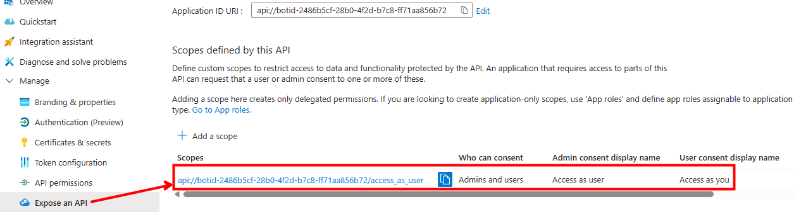
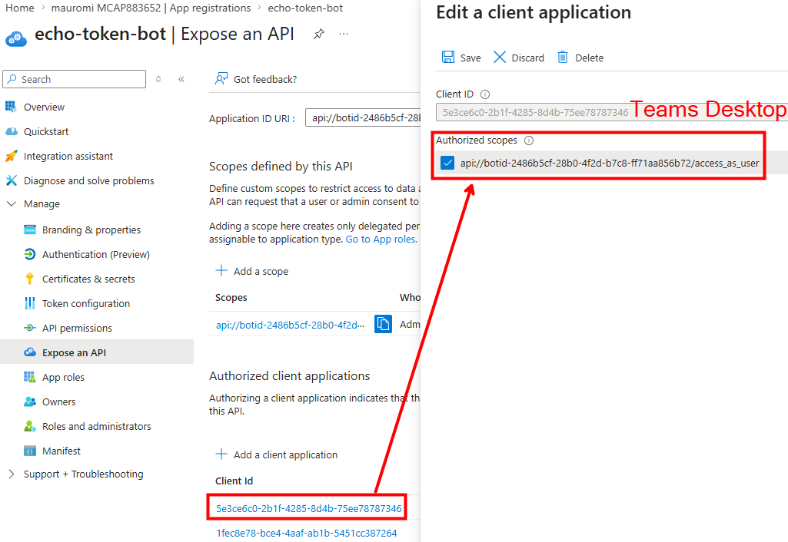
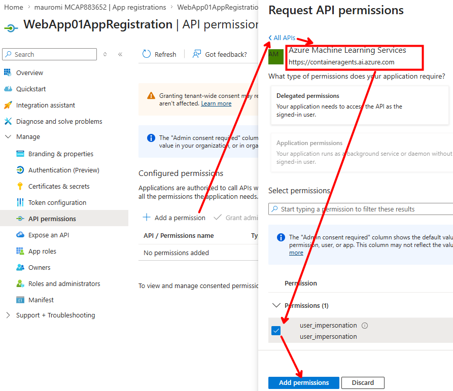
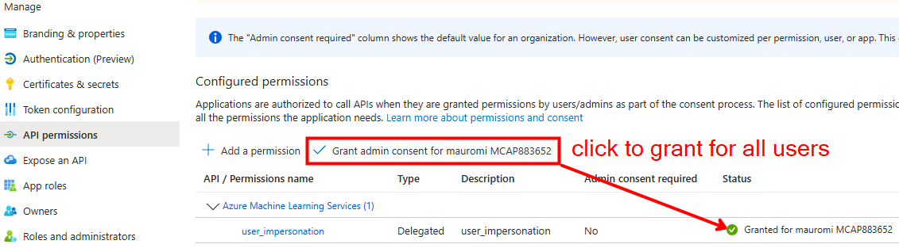
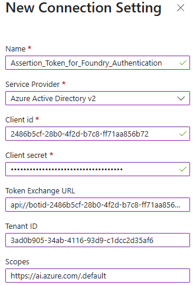
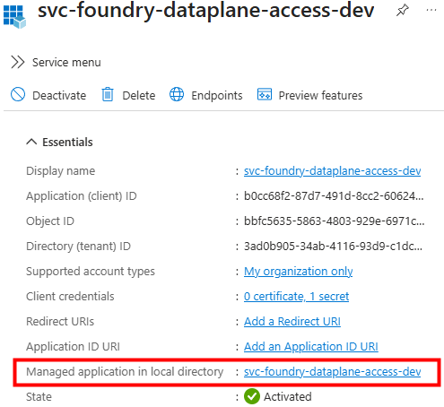
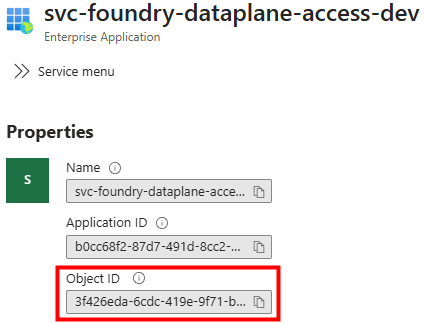
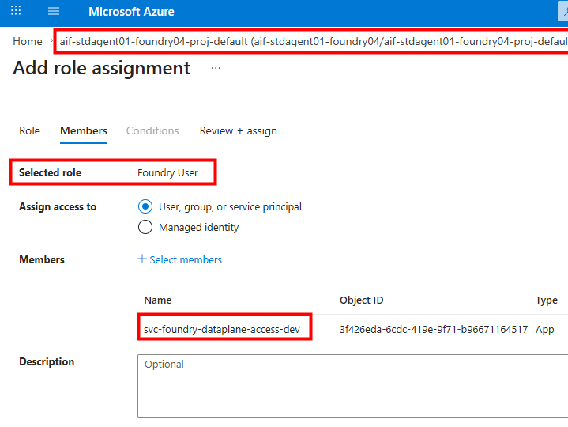

# 04 — Token B: Foundry Access

**Token B** (`aud = https://ai.azure.com`) is the token the bot places in the `Authorization` header when it calls Foundry.

> **Important:** Token B does **not** carry the user's identity into the agent's code. In theory we could use a user-delegated token, but right after Foundry validates it, **it is stripped**. So there are two options for creating Token B: **1) a user-delegated token**, or **2) an app token**.

## 4.1 Approach 1 — Token B as a user-delegated token (not recommended)

As this section's title says, creating Token B as a user-delegated token is **not worth it**, because it means paying the cost of a user-delegated token (consent, `user_impersonation`, etc.) for information that is discarded anyway. Moreover, with a user-delegated token **every single end user** would need the RBAC role on the Foundry project, whereas with the managed identity / service principal in the next approach a **single RBAC assignment** is enough.

If you nonetheless want to go this way, you must implement the following steps on the Bot's registered application.

### (1A) INCOMING TOKEN — Expose an API: the `scp` scope

The token Entra generates to access the Bot cannot carry only the Bot's registered application reference (the App ID URI `api://botid-2486…`); it must also carry the necessary **scope**. With no scope defined, there would be no permission to grant → **no token**.

So, in the **Expose an API** blade of the Bot's registered application, we create the scope in the form `<appid_uri>/scope`, which in this example is:

```text
api://botid-2486b5cf-28b0-4f2d-b7c8-ff71aa856b72/access_as_user
```

Together with the scope we also specify **who can consent** to its use — in this case both administrators and ordinary users who will access "as themselves" (*access as you*), i.e. they will sign the token with their own username.


*Bot registered application — Expose an API: the `access_as_user` scope*

### (1B) INCOMING TOKEN — Expose an API: Authorized client applications

We must also authorize, **one by one**, the applications through which users will be able to request the token to access (the registered application of) the bot. For each authorized application we specify two things:

- Its **client id**, which identifies it universally (e.g. Teams Desktop → `5e3ce6c0…`, Teams Web → `1f3c0e70…`).
- The **specific scope** defined above, e.g. `api://botid-2486…/access_as_user`.

Without a scope to reference, there would be nothing to bind the clients to.

This is the **prerequisite of OBO**: OBO works only if the incoming token is a valid delegated token with a scope on our resource. The SSO token Teams delivers has `aud = api://botid-…` and `scp = access_as_user`: it is that `scp` which qualifies it as *"a delegated token issued to access your API as the user"*. **No scope → invalid input token → OBO does not start.**

If we do **not** pre-authorize the Teams clients to ask Entra for a token for this scope, a consent prompt for that app would appear. Having authorized the Teams Desktop / Teams Mobile / Copilot clients, this happens **silently**.

When the user submits a question, Teams must send it to the Bot, and at that point **SSO fires**: Teams asks Entra for a token for that specific audience (`api://botid-2486…`) and scope (`access_as_user`), on behalf of the same signed-in user.


*Bot registered application — Expose an API: authorized client applications (Teams clients)*

### (1C) OUTGOING TOKEN — API permissions

We saw how the **incoming** token for the Bot is obtained: thanks to the scope defined in *Expose an API* (`api://botid-2486…/access_as_user`), Teams — using the user's signed-in session — silently has Entra issue an SSO token with `aud = api://botid-2486…` and `scp = access_as_user`. **This is an SSO acquisition, not an OBO.**

Now we see how Entra generates the **outgoing** token from the bot, toward Foundry: *this* one really is an **OBO token exchange**, in which the Token Service swaps the bot's SSO token for a token of the same user valid for Foundry (`aud = https://ai.azure.com`, `scp = user_impersonation`).

To obtain this outgoing token:

- Grant the delegated permission **`user_impersonation`** on the Entra app that issues tokens for Foundry. In practice we are saying: *"this registered application is authorized to obtain, from Entra, tokens with `scope = user_impersonation` towards the audience **Azure Machine Learning Services** — the first-party app valid for Foundry / Machine Learning / Cognitive Services."* Note that the permission is on the **audience in general**, not on the single project; access to the specific Foundry project is then governed by **RBAC on the project**. This is normal: the AI Foundry data plane is fronted by that first-party resource, and its delegated `user_impersonation` permission is exactly what enables user-delegated access to the Foundry data plane (audience `https://ai.azure.com`).
- Add **admin consent**: in OBO the consent must already be present (the exchange is server-side and cannot show a popup), so we pre-consent once for all tenant users, avoiding `consent_required` errors. Even though admin consent was not mandatory (each user could self-consent), granting it for everyone is exactly the right thing for OBO: the permission is pre-consented tenant-wide and the server-side exchange never hits `consent_required`.

> The blue banner in the portal says the same thing: *"The 'Admin consent required' column shows the default value for an organization… user consent can be customized per permission, user, or app."* → that column is only the theoretical default, while the green check is what you have actually applied.

This is what authorizes the OBO to produce the token with `aud = ai.azure.com` on behalf of the user, toward Foundry.


*API permissions — `user_impersonation` for Foundry*


*API permissions — admin consent granted*

### (1D) OBO via the Bot's OAuth Connection — always produces a user token

Once the Bot's registered application is configured with `client_id`, `client_secret`, `client_id_uri`, and `scope`, we can create an **OAuth Connection** on the Azure Bot Service — an *AAD v2* connection in which we specify:

- **Token Exchange URL** = the App ID URI of the **same** registered application (`api://botid-2486b5cf-28b0-4f2d-b7c8-ff71aa856b72`). This is the `aud` claim of the **incoming** SSO token generated toward the Azure Bot by Entra following Teams' request. It tells Entra: *"you must exchange (OBO) the token used to access the Bot's registered application, building another one with this `aud`."*
- `client_id`, `client_secret`, and `tenant_id` of the registered application associated with our **bot app**. Indeed, OBO works only if the app performing the exchange **matches the one in the `aud`** of the token to be exchanged. Since the token Teams generates for the app carries, as its `aud`, the Application ID URI of the **bot app**, you need the `client_id` + secret of that same app.
- The **Scope** `https://ai.azure.com/.default` makes Entra place the claims `https://ai.azure.com` and `.default` in the token. This allows successful authentication to Foundry — albeit with a "user-token" that Foundry then "strips away" — and it requires that user to hold the **Foundry User** RBAC role on the Foundry project that hosts the agent.


*Azure Bot — OAuth Connection (AAD v2): Token Exchange URL = the bot app; Scope = `https://ai.azure.com/.default`*

> **Note — interactive OAuth without SSO is a different case.** With the classic "sign-in card" of the auth-code flow, the `client_id` + secret may belong to **any** registered application in the tenant, provided it: (a) has the Bot Token Service redirect URI `https://token.botframework.com/.auth/web/redirect`; and (b) has the required API permissions/scopes (the *Scopes* field) with consent. Only there can the two apps be separate (Bot app ≠ connection app). For the **SSO path** described here, they must be the **same**.

## 4.2 Approach 2 — Token B as an app token (cleaner, chosen)

Create Token B as an **app token** using a service principal — or, better still, a **managed identity**. Here we use neither the Bot's OAuth Connection nor any delegation on the app. It is cleaner precisely because Token B has a **single job** — to pass Foundry's RBAC gate — while the user identity travels separately in the third token (custom header).

> Only **Token B** requires this RBAC role. The user identity carried in the third token (custom header, for the downstream OBO) does **not** need the Foundry User role, because it is never used to authenticate to Foundry — only as an **assertion** for the token exchange toward Graph/Fabric.

### Note: "registered application" and "service principal" are not alternatives

An **App Registration** and its **Service Principal** are two faces of the same object:

- The **App Registration** (under *App registrations*) is the global definition of the app (schema, secrets, redirect URIs, exposed scopes…).
- The **Service Principal** (under *Enterprise applications*) is the local instance / identity of that app: it is what signs tokens, signs in, and receives RBAC assignments.

They share the same **Application (client) ID** (`2486b5cf-…`) but have different **Object IDs**. When you register an app in your own tenant, the service principal is almost always created automatically.

### Reuse the Bot app or a dedicated identity?

Order of preference, cleanest first:

1. **Dedicated User-Assigned Managed Identity (UAMI)** → recommended in production on Azure.
   - No secret to manage/rotate (the biggest problem of app registrations).
   - Lifecycle independent of the Bot: the same UAMI can be reused by multiple App Services / Containers.
   - It is already a service principal: assign **Foundry User** directly in IAM (the *Managed identity* option).
   - **Limitation:** it only works when running on Azure. Locally you use a fallback (e.g. `DefaultAzureCredential`, which uses the UAMI on Azure and falls back to `az login` / secret locally).
2. **Dedicated App Registration** (different from the Bot's) → a good compromise if you must run outside Azure or want a portable identity; keeps responsibilities separate. **← this is the choice made in this reference.**
3. **Reuse of the Bot's own app** (`2486b5cf-…`) → works, but is the least clean: it couples two different responsibilities on the same principal — the Bot Framework identity (`MicrosoftAppId`/`Password`) and the Foundry data-plane access identity — and still forces you to manage a secret.

> In short: if the Bot runs on App Service in Azure → **dedicated UAMI**. Keep "reuse the Bot app" only as a shortcut for dev/local.

### Why an app token uses neither the OAuth Connection nor a delegation

The OAuth Connection **cannot create an app token** — it creates only **user tokens**. Even configured with `client_id` + `client_secret`, those credentials serve the connection to perform the **on-behalf-of exchange of the user**: the output is always a user-delegated token, never an app-only token. The OAuth Connection is, by construction, tied to the user's sign-in (it is what feeds the `OAuthPrompt`). So an expectation like *"I create the app token by putting the second app's client id + secret into the OAuth Connection"* would not work — a **user token** would still come out.

**So how does the Bot create the app token toward Foundry?** In the Bot's code, with a **client-credentials** flow (not the OAuth Connection), using `client_id` + secret of a **second** app (or the UAMI). Concretely, these simple steps:

### (2A) Create a second registered application

Create a new registered application in Entra and retrieve its **Client ID** and **Client Secret**. In this reference it is named `svc-foundry-dataplane-access-dev` because:

- The `svc` prefix marks it as a **service identity** (not a user, not a bot).
- `foundry-…-access`/`dataplane` states the **purpose** (data-plane access).
- The optional `dev` suffix marks the **project/environment**.

As shown in the two screenshots, it is important to navigate from the registered application to its **Managed application** — i.e. the **service principal** that represents the *instance* of this registered application — which will be given the **Foundry User** RBAC role, so that tokens signed by this application can be used to invoke Foundry through the Responses protocol.


*`svc-foundry-dataplane-access-dev` — App Registration overview*


*`svc-foundry-dataplane-access-dev` — link to the Managed application (service principal)*

### (2B) Assign the Foundry User RBAC role

Assign the **Foundry User** RBAC role to the Enterprise Application (service principal) created in 2A, on the Foundry project that contains the agent.

Any identity that ends up in the `Authorization` header to create/use Token B — whether the App Service's managed identity or a user — must hold the data-plane RBAC role on the Foundry project, i.e. **Foundry User** *(in some tenants this role may appear as "Azure AI User")*. Without that role, the call to the agent's endpoint is rejected **upstream**, before it ever reaches the agent's code.

> Although it is a relatively **powerful** role (it can invoke but also modify the agent, even delete it, and view conversations of this or other agents in the same project), it is the **minimum predefined role** that allows invoking the agent. This is another reason to use the **service principal / managed identity** of the second registration — rather than the user's name — to mint the token toward Foundry.


*RBAC — Foundry User role assigned to `svc-foundry-dataplane-access-dev` on the Foundry project*

### (2C) Configure the bot's `.env`

Store the values collected from this second Entra application separately from those of the first registered application (linked to the bot), and distinct from the agent's call-target values:

```bash
# Bot credentials
MicrosoftAppType=SingleTenant
MicrosoftAppId=2486b5cf-28b0-4f2d-b7c8-ff71aa856b72
MicrosoftAppPassword=iv***Q
MicrosoftAppTenantId=3ad0b905-34ab-4116-93d9-c1dcc2d35af6

# Local server port
PORT=3978

# OAuth Connection created on the Azure Bot (Teams SSO -> token aud=ai.azure.com)
connectionName=ai-foundry-sso

# Hosted agent to invoke (call target)
FOUNDRY_AGENT_PROJECT_ENDPOINT=https://foundry7159.services.ai.azure.com/api/projects/aif7159-standard-agent-project
FOUNDRY_AGENT_NAME=ha01-echoagent
FOUNDRY_AGENT_API_VERSION=2025-11-15-preview

# Registered application / service principal that TALKS to Foundry
# (svc-foundry-dataplane-access-dev)
# The name makes it clear, in Enterprise applications and in RBAC assignments,
# that this service principal exists only to sign the token towards Foundry
# and is the one to assign Foundry User on the project.
#   svc-/id- prefix = it is a service identity (not a user nor a bot)
#   foundry-…-access/dataplane = purpose (data plane access)
#   optional suffix = project/environment.
FOUNDRY_ACCESS_TENANT_ID=3ad0b905-34ab-4116-93d9-c1dcc2d35af6
FOUNDRY_ACCESS_CLIENT_ID=b0cc68f2-87d7-491d-8cc2-60624256126e
FOUNDRY_ACCESS_CLIENT_SECRET=4bp***J
```

### (2D) Mint Token B in `mainDialog.js`

Here we use our custom function `callFoundry`, which retrieves the answer:

```js
const { ClientSecretCredential } = require('@azure/identity');
const { callFoundry } = require('../foundry');

// App-only credential (client credentials) of the service principal dedicated
// to Foundry access. Locally it uses client id + secret from .env; on Azure
// you can replace it with a Managed Identity (e.g. DefaultAzureCredential).
const foundryCredential = new ClientSecretCredential(
    process.env.FOUNDRY_ACCESS_TENANT_ID,
    process.env.FOUNDRY_ACCESS_CLIENT_ID,
    process.env.FOUNDRY_ACCESS_CLIENT_SECRET
);

// (...)

// Token B: app-only (aud=https://ai.azure.com) signed by the dedicated SP.
// The OAuthPrompt user token is no longer used here: it will serve
// as the "third token" (user assertion) for the downstream OBO.
const foundryToken = (await foundryCredential.getToken('https://ai.azure.com/.default')).token;

const { answer, user } = await callFoundry(foundryToken, userText);
await stepContext.context.sendActivity(
    `Foundry (user: ${user || 'n/a'}):\n${answer}`
);
```

### (2E) Call the Responses endpoint in `foundry.js`

Here is how to implement the `callFoundry` function which — besides writing logs — invokes the agent's **Responses** endpoint through a POST, placing the token in the `Authorization` header:

```js
const axios = require('axios');

// Calls the Foundry Hosted Agent passing the Foundry access token
// (aud=ai.azure.com). Today it is an app-only token obtained via client
// credentials of the dedicated service principal (Foundry User on the project).
// The function is token-agnostic: it receives a bearer and uses it in the Authorization.
async function callFoundry(foundryToken, text) {
    const projectEndpoint = process.env.FOUNDRY_AGENT_PROJECT_ENDPOINT;
    const agentName = process.env.FOUNDRY_AGENT_NAME;
    const apiVersion = process.env.FOUNDRY_AGENT_API_VERSION;
    const url = `${projectEndpoint}/agents/${agentName}/endpoint/protocols/openai/responses?api-version=${apiVersion}`;

    // TEMPORARY LOG: invoked endpoint and identity of the outgoing token
    try {
        const p = JSON.parse(Buffer.from(foundryToken.split('.')[1], 'base64').toString('utf8'));
        console.log('--- CHIAMATA FOUNDRY (responses) ---');
        console.log('url  :', url);
        console.log('aud  :', p.aud);            // expected: https://ai.azure.com
        console.log('appid:', p.appid || p.azp); // expected: FOUNDRY_ACCESS_CLIENT_ID
        console.log('idtyp:', p.idtyp);          // 'app' = app-only token
    } catch (e) {
        console.log('Unable to decode the foundryToken:', e.message);
    }

    const res = await axios.post(
        url,
        { input: text },
        {
            headers: {
                Authorization: `Bearer ${foundryToken}`,
                'Content-Type': 'application/json'
            }
        }
    );

    // Text of the agent's response
    const answer = res.data.output?.[0]?.content?.[0]?.text ?? '(nessun testo)';
    // "user" field as seen by Foundry (useful to verify the identity)
    const user = res.data.user ?? '';
    return { answer, user };
}
module.exports = { callFoundry };
```

At this stage the bot can reach the agent, but the call still carries **no user identity** the agent can use downstream. That is what **Token C** solves — but first, [Chapter 05](05-two-identity-axes.md) explains *why* we used two separate registered applications.

---

**Next:** [05 — Two Identity Axes](05-two-identity-axes.md)
