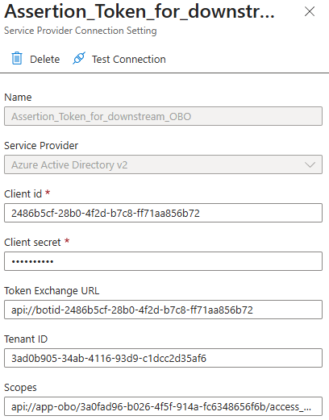
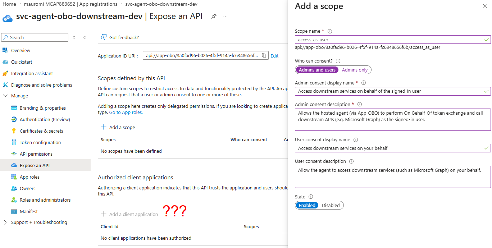
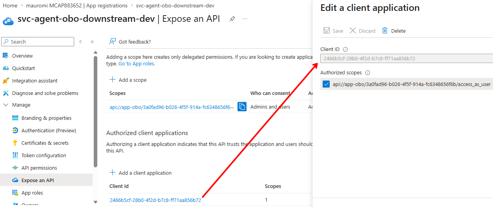
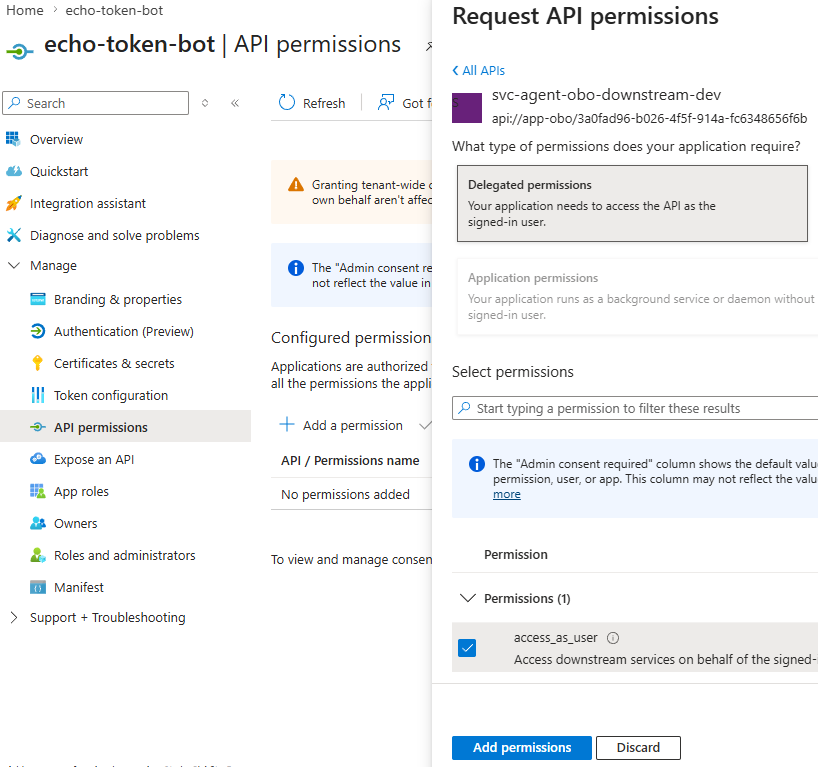
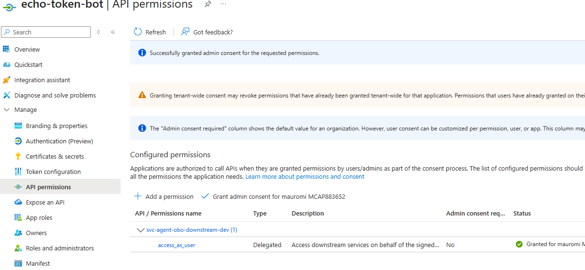

# 07 — Token C: The User Assertion (the critical part)

## 7.1 The critical point: the audience of the "third token"

Now comes the most important part of this exercise. We did send **Token B** to the Foundry agent to "get into" the agent — but if Foundry must in turn talk to a service protected by Entra that requires **identifying the user** who signed Token A (the one Teams used to invoke the Bot), then Token B is **not enough**.

And because the Foundry agent **threw Token B away**, we cannot obtain the new token from inside the Foundry agent. We must go back to the **Bot** and have it generate **another** token — call it **Token C** — signed by the original user and usable by Foundry to "do OBO", i.e. contact a remote service on the user's behalf. Since authentication to Foundry already happens through Token B in the `Authorization` header, **Token C must travel as an additional token in the same call** the Bot makes to Foundry.

So the custom bot must implement **two features**:

1. Generate a **user token** — "Token C" — to pass to Foundry; however, this token **cannot have `aud = ai.azure.com`** (Foundry), but rather a **"service identity"** that can then be delegated to access the downstream services.
2. Send Token C to Foundry in a **custom header**, different from the `Authorization` header, so Foundry lets it pass through without stripping it. The name chosen for this custom header is **`x-ms-user-assertion`**.

## 7.2 Token C — three key points: for which scope, with which identity, with which tool

### Point 1 — for which scope we create Token C

The scope of Token C is the crucial point. For an agent to perform OBO, you need a **confidential application** that exposes a specific scope, and that is built with the `client_id` and `client_secret` of the registered application publishing that scope. This scope is what defines the **audience** of the token that will become the **`user_assertion`**.

We could use the Bot's app, but it is conceptually dirty: we would mix the Bot's identity with that of the downstream service. It is much cleaner to create a **second registered application dedicated to the downstream**, e.g. `svc-agent-obo-downstream-dev`. From this app we get:

- `client_id`, e.g. `3a0fad96-b026-4f5f-914a-fc6348656f6b`
- `client_secret`
- `clientid_url`, e.g. `api://app-obo/3a0fad96-b026-4f5f-914a-fc6348656f6b`
- `scope`, e.g. `api://app-obo/3a0fad96-b026-4f5f-914a-fc6348656f6b/access_as_user`

The scope is what we will use to create Token C, which becomes the `user_assertion`.

> **Why not use Foundry as the scope?** If Token C had `audience = Foundry` (`https://ai.azure.com`), the agent would have to perform OBO using Foundry's `client_id` + `client_secret`, which it obviously does not possess. So it is impossible.

At this point we can show the code of the Foundry agent that receives the `user_assertion` and exchanges it, via OBO, for a token toward Graph — which we call **Token D**:

```python
tenant_id     = os.environ.get("APP_OBO_TENANT_ID")
client_id     = os.environ.get("APP_OBO_CLIENT_ID")
client_secret = os.environ.get("APP_OBO_CLIENT_SECRET")
user_assertion = context.client_headers.get("x-ms-user-assertion")
GRAPH_SCOPES = ["https://graph.microsoft.com/Files.Read"]

app = msal.ConfidentialClientApplication(
    client_id,
    client_credential=client_secret,
    authority=f"https://login.microsoftonline.com/{tenant_id}",
)

result = app.acquire_token_on_behalf_of(
    user_assertion=user_assertion, scopes=GRAPH_SCOPES
)

if "access_token" not in result:
    return (
        f"[graph] OBO failed: {result.get('error')}: "
        f"{str(result.get('error_description', ''))[:300]}"
    )

# One-shot Graph call: list OneDrive root children, pick the biggest folder.
resp = requests.get(
    GRAPH_ROOT_CHILDREN,
    headers={"Authorization": f"Bearer {result['access_token']}"},
    timeout=30,
)
```

### Point 2 — which identity creates Token C

We have already established the scope Token C must have (the scope exposed by the downstream-dedicated registered application). Now we need the **application identity** that must create this token.

The answer is simple: **Token C must be issued by the same app registration that Teams uses to authenticate the user toward the bot** — i.e. the **Bot app**.

Why? Because the token Teams presents to the Bot Service has `audience = client_id of the bot`. Only that app is authorized by Entra ID to perform the OBO token exchange on behalf of the user. If you tried to create Token C using a different app registration, Entra ID would refuse the OBO: *"this app is not the one that received the token from Teams, so I cannot do a token exchange."*

In practice:

1. Teams obtains a token for the Bot's registered app.
2. The Bot Service validates that token.
3. When the bot requests an OBO token, it must use **the same app** to ask Entra ID for a new token.
4. To do so, it needs the `client_id` + `client_secret` of the Bot's registered app.
5. And **to whom must Token C be returned?** To the caller — the same Bot app registration — via its `clientid_url` (which becomes the Token Exchange URL).

**Operational summary:**

| Setting | Value |
|---------|-------|
| Client ID | the Bot app registration's |
| Client Secret | the same app's secret |
| Token Exchange URL | its `clientid_url` |

### Point 3 — with which tool we create the token

At this point the choice of tool is just an operational detail: we have already defined the **scope** (Point 1) and the **application identity** that must issue the token (Point 2). We can create Token C in two ways:

1. **In the bot's code**, implementing the token exchange manually to obtain the token with the downstream scope.
2. **With a managed tool** — the bot's **OAuth Connection** — which automatically performs the token-exchange flow using the information defined in the previous points.

In both cases the required parameters are exactly those already identified:

- `client_id` of the Bot's app registration
- `client_secret` of the same app
- Token Exchange URL = `clientid_url` of the Bot's app
- `scope` = the scope of the `svc-agent-obo-downstream-dev` app (Point 1)

The screenshot below shows exactly these values: the bot's identity (`client_id`, `client_secret`, Token Exchange URL) and the downstream scope (the dedicated app's scope).

<br/>
*OAuth Connection for Token C — the bot's identity plus the downstream (App-OBO) scope*

## 7.3 Characteristics of the Downstream Registered Application

We said it is best to create a **dedicated registered application** to manage access to the downstream services — those Entra-protected services the agent must invoke on behalf of the user who started the conversation in Teams. Creating it takes two steps.

### 1. The "base" of the app

- **Name:** in our case `svc-agent-obo-downstream-dev`
- **Application (client) ID:** generated automatically by Entra → `3a0fad96-b026-4f5f-914a-fc6348656f6b`
- **Client secret:** we will need it in the hosted agent to create the confidential application.

These two values identify the application, but are **not enough** to use it as the audience of Token C.

### 2. Configure the *Expose an API* section

For this app to be usable as the audience of Token C (the `user_assertion`), we must configure three elements:

**a) Application ID URI** — the URL that represents the audience of the token the bot will return. It normally starts with `api://<client-id>`, but it is much more readable to use an explicit syntax, e.g.:

```text
api://app-obo/3a0fad96-b026-4f5f-914a-fc6348656f6b
```

**b) Scope** — since this app is used as the audience for a **delegated** token, the scope must represent access "as the user". The most common, readable name is `access_as_user`, producing the full scope URI:

```text
api://app-obo/3a0fad96-b026-4f5f-914a-fc6348656f6b/access_as_user
```

**c) Consent** — since Token C is generated by the bot on the user's behalf, the user must be able to grant the permission. So we select **Who can consent? → Admins and users**.


*App-OBO — Expose an API: Application ID URI, `access_as_user` scope, and consent configured*

> The screenshot above correctly shows the Application ID URI, the `access_as_user` scope, and the configured consent — but it is **still missing** the "Authorized client applications" part: *which application is authorized to request this scope?* That will be the Bot's registered application.

### Authorized client applications

Now we configure the **Authorized client applications** section. The right question is: *who requests the scope `api://app-obo/.../access_as_user`?*

As we saw earlier, the answer is: the **bot's OAuth Connection** requests it, using the Bot's registered app as its application identity. In other words, **the client of App-OBO is the Bot.** Pre-authorizing the Bot as a client of App-OBO is a best practice: it lets the Bot obtain Token C in **SSO mode, without a consent prompt**. This makes the Token A → Token C flow silent and enables the OBO toward the downstream services.


*App-OBO — Authorized client applications: the Bot is pre-authorized on `access_as_user`*

## 7.4 Two mechanisms, same effect (and why both work)

To let the Bot obtain a token for the scope `api://app-obo/.../access_as_user`, we must make sure that permission has **already been granted**, so the Bot can request it without a consent prompt. This can be achieved in two equivalent ways.

### 1) Pre-authorization (what we already did)

In App-OBO → *Expose an API* → *Authorized client applications*, add:

- Client ID of the Bot
- Scope: `access_as_user`

**Effect:** the Bot is pre-authorized to request that scope; consent is already implicit; the Token A → Token C exchange happens in **SSO mode, without interactions**. It is the same model as Teams SSO: you pre-authorize the client, and the flow is silent.

### 2) API Permissions + Admin consent (the "classic" route)

In the Bot's app → *API permissions*:

- add the delegated permission `access_as_user` of the App-OBO app
- **Grant admin consent**

**Effect:** the Bot obtains the scope because an admin granted the permission.

### When is #2 really needed?

If we have already done the pre-authorization (#1), #2 becomes **redundant**:

- The pre-authorization is already a valid consent.
- The Bot can obtain Token C without a prompt.
- The OBO works even without touching the Bot's API Permissions.

### Practical advice

Why add the delegated `access_as_user` permission anyway, under *Bot app → API permissions → Add permission → App-OBO → Delegated → access_as_user → Grant admin consent*?

- It **explicitly documents** that the Bot calls App-OBO.
- It is useful in **audits**.
- It is "belt and suspenders": it changes nothing, but it is tidier.

### Final synthesis

- The **pre-authorization** on App-OBO is the real authorization.
- The Bot's API Permissions are the same thing, seen from the client side.
- Having both is just cleaner, but **not necessary** for the OBO to work.


*Bot — API permissions view*


*App-OBO — admin consent granted*

---

**Next:** [08 — Token D: The Downstream OBO](08-token-d-downstream-obo.md)
