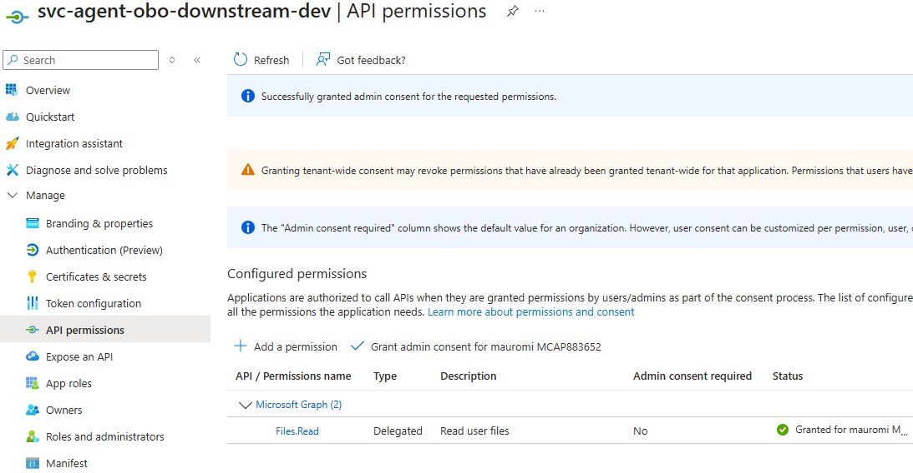

# 08 — Token D: The Downstream OBO (agent side)

## 8.1 The Hosted Agent now has everything it needs for OBO

At this point:

- we have created **App-OBO** (the registered application dedicated to the downstream);
- we have defined the scope **`access_as_user`**;
- we have **pre-authorized the Bot** as a client of App-OBO;
- the Bot is able to generate **Token C** (`user_assertion`) with `audience = App-OBO`.

The **Hosted Agent** must have the **`client_id` and `client_secret` of App-OBO**, so it can create a `ConfidentialClientApplication` and exchange Token C for a new downstream token (**Token D**).

**Why must the agent hold App-OBO's `client_id` + secret?** Because in the OBO flow:

- Token C is a **delegated** token with `audience = App-OBO`;
- the agent must present it to Entra ID as the **`user_assertion`**;
- and it must **prove it is the application representing App-OBO**;
- therefore it must authenticate with App-OBO's `client_id` + `client_secret`.

Only then does Entra ID accept the flow: **Token C → Token D** (`audience = downstream service`).

## 8.2 Token D: an audience "of the agent's choosing"

Once the agent has Token C and its App-OBO confidential app, it can request **any** downstream token, for example:

- Microsoft Graph
- an enterprise API
- any Entra-protected service

The audience "of the agent's choosing" is simply the **scope the agent requests** in its `acquire_token_on_behalf_of`. For example:

```python
GRAPH_SCOPES = ["https://graph.microsoft.com/Files.Read"]
```

## 8.3 But watch out: the downstream scope must be authorized in App-OBO

For the flow to work, **App-OBO** must have the following in its **API Permissions**:

```text
Microsoft Graph → Delegated → Files.Read   (or whatever permission the agent wants to request)
```

Why?

- Token C is delegated → Token D must be delegated.
- App-OBO must be authorized to request that scope.
- Otherwise Entra ID rejects the OBO with an **`invalid_scope`** error.

The screenshot below is exactly this: App-OBO has `Files.Read` with consent already granted.


*App-OBO — Microsoft Graph `Files.Read` as a delegated permission, consent granted*

## 8.4 Operational summary

- The Hosted Agent must hold App-OBO's `client_id` + `client_secret` (parked in `.env`).
- With these it creates a `ConfidentialClientApplication`.
- It receives **Token C** from the bot (custom header `x-ms-user-assertion`).
- It exchanges Token C for **Token D** via `acquire_token_on_behalf_of`.
- Token D's audience is "of the agent's choosing", but it **must** be present as a **delegated permission** in App-OBO → API Permissions.

---

**Next:** [09 — Publishing the App to Teams](09-publishing-to-teams.md)
