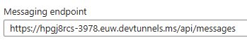
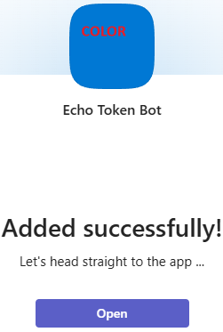

# 09 — Publishing the App to Teams

## 9.1 Step 1 — Update the manifest with the current tunnel

To test the bot locally we:

- run the bot on our PC;
- expose `/api/messages` through a **public tunnel**;
- update the Teams manifest with the tunnel domain;
- verify that the Azure Bot points at the same endpoint.

The manifest must include the tunnel domain in **`validDomains`**, so Teams can call the bot without security blocks. In parallel, in the Azure portal, the Azure Bot's **Messaging endpoint** must be set to the same tunnel URL — e.g. `https://hpgj8rcs-3978.euw.devtunnels.ms/api/messages`:


*Azure Bot — Messaging endpoint pointing at the current dev tunnel*

The manifest below is perfect for this scenario:

- `botId` = the bot app
- `webApplicationInfo.id` = the same app
- `resource` = the bot's audience (`api://botid-...`)
- `validDomains` includes the tunnel domain
- no other field needs changes for local testing

The manifest is consistent with the Azure Bot, the bot's registered app, the tunnel, the SSO flow, and the Token A → Token C exchange. Note that `resource` — `api://botid-2486b5cf-28b0-4f2d-b7c8-ff71aa856b72` — must be **exactly** the bot's audience, because Teams asks Entra ID for a token with `audience = this value`, the Bot Service validates that token, and the OAuth Connection uses the same app to generate Token C.

```json
{
  "$schema": "https://developer.microsoft.com/en-us/json-schemas/teams/v1.17/MicrosoftTeams.schema.json",
  "manifestVersion": "1.17",
  "version": "1.0.0",
  "id": "2486b5cf-28b0-4f2d-b7c8-ff71aa856b72",
  "developer": {
    "name": "Mauro Minella",
    "websiteUrl": "https://example.com",
    "privacyUrl": "https://example.com/privacy",
    "termsOfUseUrl": "https://example.com/terms"
  },
  "name": {
    "short": "Echo Token Bot",
    "full": "Echo Token Bot - Foundry SSO"
  },
  "description": {
    "short": "Bot che chiama Foundry come l'utente Teams",
    "full": "Bot che usa Teams SSO per ottenere il token utente e invocare un Foundry Hosted Agent con la stessa identita'."
  },
  "icons": {
    "color": "color.png",
    "outline": "outline.png"
  },
  "accentColor": "#0078D4",
  "bots": [
    {
      "botId": "2486b5cf-28b0-4f2d-b7c8-ff71aa856b72",
      "scopes": ["personal"],
      "supportsFiles": false,
      "isNotificationOnly": false
    }
  ],
  "permissions": ["identity", "messageTeamMembers"],
  "validDomains": [
    "hpgj8rcs-3978.euw.devtunnels.ms",
    "token.botframework.com"
  ],
  "webApplicationInfo": {
    "id": "2486b5cf-28b0-4f2d-b7c8-ff71aa856b72",
    "resource": "api://botid-2486b5cf-28b0-4f2d-b7c8-ff71aa856b72"
  }
}
```

**In short:** the tunnel is in the manifest ✓, the tunnel is in the Messaging endpoint ✓, the `botId` matches the registered app ✓, the `resource` matches the bot's audience ✓ — the manifest is ready to be published in Teams.

## 9.2 Step 2 — Create the package ZIP

A Teams package is simply a ZIP with exactly **three files at the root** of the archive:

- `manifest.json`
- `color.png`
- `outline.png`

> 🔑 **Rule:** the files must be at the **root** of the ZIP, not inside a subfolder. That is why you zip from **inside** the `teamsApp` folder, not from outside.

The default `zip` command **updates** the archive: it adds new files and overwrites same-named ones, but does **not** remove files already inside that you no longer list — so "residues" would remain. To start clean, the safest way is to delete the ZIP first and recreate it from scratch (so you are sure it contains only the 3 correct files):

```bash
cd teamsApp && rm -f echo-token-bot.zip && zip -j echo-token-bot.zip manifest.json color.png outline.png && echo "--- CONTENUTO ZIP ---" && unzip -l echo-token-bot.zip && cd ..
```

## 9.3 Step 3 — Sideload the package into Teams

1. Open Microsoft Teams in the cloud: `https://teams.cloud.microsoft/` (confirm you are signed in with the correct account).
2. In the left sidebar click **Apps**. If you do not see it, click **…** (*More apps*).
3. In the Apps panel, find and click **Manage your apps**.
4. Click **Upload an app**.
5. Choose **Upload a custom app** (or *Upload a customized app*).
6. Select the ZIP file: `echo-token-bot.zip`.
7. Teams shows the preview card for the **Echo Token Bot** app → click **Add**.

The app is then uploaded and installed. The screen shown below (*"Added successfully!"*) is exactly the expected result.


*Teams — "Added successfully!": the app is installed*

## 9.4 Step 4 — Verify silent token acquisition

With the app installed, send a message and confirm the bot acquired **both** tokens, correct and distinct. The expected claim values — and the final code that forwards Token C — are covered in the next chapter.

---

**Next:** [10 — Wiring Token C & Verification](10-wiring-and-verification.md)
