# Appendix A — The Three Registered Applications

This appendix is a **per-application reference** for the three Entra registered applications used in this scenario, organized by Entra portal blade: **Overview**, **Certificates & secrets**, **Expose an API**, and **API Permissions**. It consolidates, in one place, what each application is for and how each of its settings is actually used by the code.

> Values are taken from the validated development environment; secrets are masked. Substitute your own when reproducing.

## A.1 Overview

| Application | Role | Display name | Application (client) ID | Directory (tenant) ID |
|-------------|------|--------------|-------------------------|------------------------|
| **Bot** | Authenticates access to the bot service | `echo-token-bot` | `2486b5cf-28b0-4f2d-b7c8-ff71aa856b72` | `3ad0b905-34ab-4116-93d9-c1dcc2d35af6` |
| **Foundry Access** (or Managed Identity) | Service identity to authenticate toward Foundry | `svc-foundry-dataplane-access-dev` | `b0cc68f2-87d7-491d-8cc2-60624256126e` | `3ad0b905-34ab-4116-93d9-c1dcc2d35af6` |
| **Downstream Access** | Service identity to perform OBO toward downstream services (e.g. MS Graph) from inside the Foundry hosted agents | `svc-agent-obo-downstream-dev` | `3a0fad96-b026-4f5f-914a-fc6348656f6b` | `3ad0b905-34ab-4116-93d9-c1dcc2d35af6` |

## A.2 Certificates & secrets

### A.2.1 Bot registered application (`echo-token-bot`)

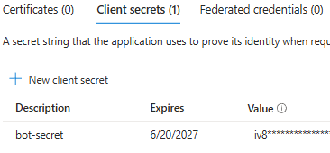
*Bot registered application — Certificates & secrets*

The `client_id` + `client_secret` of the Bot registered application are used to **perform OBO**: to exchange **Token A** (presented by Teams to the app) for **Token C** (with `aud = api://app-obo/…/access_as_user`).

How do we perform this OBO? We could do it through an MSAL Confidential Application (as Foundry will later do to exchange that token for one with `aud = MS Graph`), but here we choose a more **managed** method: we use an **OAuth Connection**, to which we provide `client_id` and `client_secret` so it exchanges the user-token received from Teams (Token A) for **another user-token still associated with the same Teams user** (delegated identity preserved), but with the `aud` + `scp` of the downstream OBO app → **Token C**:

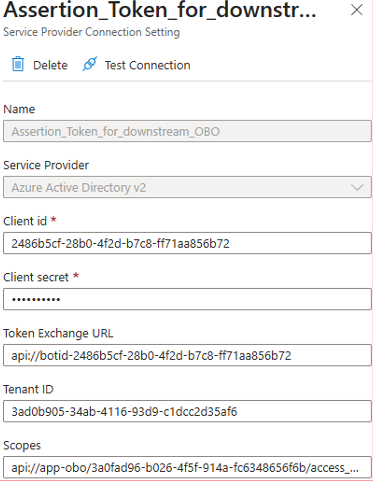
*Bot — OAuth Connection (AAD v2) that exchanges Token A for Token C*

Note that the OAuth Connection can perform the OBO precisely because **the Bot is the `aud` of Token A**. You must authenticate as that audience → which is why the **Bot's credentials** are needed.

The **Token Exchange URL** is the element that enables the bot's **silent Single Sign-On (SSO)** in Teams. Without it the connection would only do interactive login (card + browser + redirect); with it, it can perform the SSO exchange without asking the user anything. This value equals the **App ID URI** of the Bot registered application — here `api://botid-2486…` — i.e. the identifier of the resource/audience Teams must request the first SSO token for (Token A). By setting the Token Exchange URL, we tell the OAuth Connection: *"to obtain the token you may attempt an SSO exchange; there is no need to show the sign-in card."* In fact, the one that generates that token is Teams: Teams sees that URI and silently asks Entra for an SSO token with `aud = that URI` → **Token A** (`aud = api://botid-2486b5cf...`).

Inside the BOT, Token A transits only in the `invoke signin/tokenExchange`, handled by `handleTeamsSigninTokenExchange` (`bot.js`), where it is available as `query.token`. The Token Service uses it as the assertion for the OBO and produces **Token C**. It is Token C that we then retrieve in `callStep` via `stepContext.result.token` (the `userAssertion` variable), and that we forward to the agent in the custom header:

```js
async handleTeamsSigninTokenExchange(context, query) {
    // TEMPORARY LOG: raw Teams SSO token
    // (expected aud = api://bot-<appId>)
    try {
        const t = query?.token || context.activity?.value?.token;
        if (t) {
            const p = JSON.parse(Buffer.from(t.split('.')[1], 'base64').toString('utf8'));
            console.log('--- SSO TOKEN IN INGRESSO (Teams) ---');
            console.log('aud  :', p.aud);
            console.log('scp  :', p.scp);
            console.log('appid:', p.appid || p.azp);
            console.log('upn  :', p.upn || p.preferred_username);
        }
    } catch (e) {
        console.log('Unable to decode the SSO token:', e.message);
    }
    await this.dialog.run(context, this.dialogState);
}
```

Inside the BOT we retrieve this Token C (in the `stepContext` of `callStep`, from which we extract the token — called `userAssertion` — with `stepContext.result.token`):

```js
// 2) Retrieve Token C (user assertion) - mainDialog.js
async callStep(stepContext) {
    // === Retrieval of Token C (user assertion) via OAuthPrompt ===
    // The delegated user token arrives here (stepContext.result). It is the
    // "third token" (Token C, aud=api://app-obo/<App-OBO-clientid>)
    // that will be forwarded to the agent in a custom header
    // for the downstream OBO.
    const tokenResponse = stepContext.result;
    const userAssertion = tokenResponse.token; // Token C
```

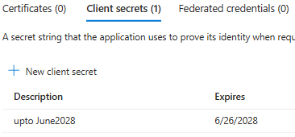
*Bot — retrieving Token C (the user assertion) in `callStep`*

### A.2.2 Foundry Access registered application (`svc-foundry-dataplane-access-dev`)

The secret of the Foundry Access registered application **is NOT used to perform OBO**. This secret (together with the `client_id`) is used to create the **app-token B** for Foundry (where the app is precisely the service identity for Foundry), which is used as the Bearer token when invoking the Foundry agent's Responses API endpoint:

```js
// mainDialog.js
const foundryCredential = new ClientSecretCredential(
    process.env.FOUNDRY_ACCESS_TENANT_ID,
    process.env.FOUNDRY_ACCESS_CLIENT_ID,
    process.env.FOUNDRY_ACCESS_CLIENT_SECRET
);
const foundryToken = (await foundryCredential.getToken('https://ai.azure.com/.default')).token;
const { answer, user } = await callFoundry(foundryToken, userText, userAssertion);
```

```js
// foundry.js
// Token B (app-only) in Authorization;
// Foundry validates it for RBAC and strips it.
// Token C (user assertion) travels in the custom header
// "x-client-user-token", which Foundry forwards
// to the agent container as-is (no chunking needed).
const headers = {
    Authorization: `Bearer ${foundryToken}`,
    'Content-Type': 'application/json'
};
if (userAssertion) {
    headers['x-client-user-token'] = userAssertion;
    console.log(`user assertion in header x-client-user-token: Token C len=${userAssertion.length}`);
}
const res = await axios.post(
    url, // "http://localhost:8088/responses?api-version=v1"
    { input: text },
    { headers }
);
```

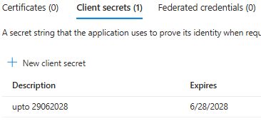
*`svc-foundry-dataplane-access-dev` — Certificates & secrets*

Key properties of this identity:

- This token is **stripped** by Foundry — which is why there is no point in it being a user-token (that would have required the user to hold the **Foundry User** RBAC role on the Foundry project). The user's identity travels **separately** in Token C.
- Naturally, the **service principal** of this identity must be added to the **Foundry User** of the Foundry project.
- **No user** is bound to this identity — only **app-tokens** are generated for it.
- It **can be shared** across all bots that need to open a conversation toward Foundry.
- It carries `client_id` + `client_secret` to build the `foundryCredential` object.
- It allows creating **Token B** via `foundryCredential.getToken('https://ai.azure.com/.default')`.
- The audience `aud = https://ai.azure.com` lets the token be used in the `Authorization` header toward the Foundry Hosted Agent via the Responses API.
- Its service principal must be **Foundry User** (RBAC) on the Foundry project.
- It needs **no API permissions**, because Foundry verifies the token is Foundry User, checks its `aud`, lets the call through, and then discards the identity.
- It needs **neither** an App ID URI **nor** a Scope.

### A.2.3 Downstream Access registered application (`svc-agent-obo-downstream-dev`)

This secret, together with the `client_id`, is used to **perform OBO**: we use as the `user_assertion` the Token C provided by the BOT, obtaining **Token D** with `aud = MS Graph` (= `https://graph.microsoft.com/Files.Read`).

To perform OBO it requires creating a **confidential application** through MSAL, with `client_id` and `client_secret`:

```python
conf_app = msal.ConfidentialClientApplication(
    client_id,
    client_credential=client_secret,
    authority=f"https://login.microsoftonline.com/{tenant_id}"
)
msgraph_token = conf_app.acquire_token_on_behalf_of(
    user_assertion=user_assertion, scopes=GRAPH_SCOPES
)
```

Key properties of this identity:

- It **can be shared** across all bots/agents that need to reach downstream services (e.g. MS Graph).
- The downstream services must be **authorized** in the Entra **API Permissions** section (see [A.4.2](#a42-downstream-access-app-obo)).
- It serves to create **user-tokens** in which the user is extracted from the "source" token being exchanged.

## A.3 Expose an API

### A.3.1 Bot registered application

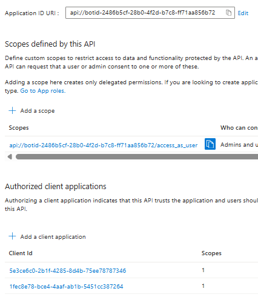
*Bot — Expose an API: the Application ID URI*

The **Application ID URI** lets you "point" to this registered application from the outside — for example when the Teams App (through its manifest) must point to the BOT that acts as the bridge toward the agent. Note that the URL reported here contains the `botid-` prefix; even better, you can use the explicit syntax `api://app-bot/2486…`.

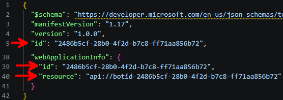
*Bot — Expose an API: the `access_as_user` scope and the authorized Teams clients*

- **Scopes** — we add one of type `access_as_user`, because this is the actual scope the Teams client will use.
- **Client applications** — these are the client applications that can present themselves to Entra with their own token (received when the user signed in in the morning) to request the token needed for the scope above. The two applications shown here are in fact the two registered applications of **Teams Desktop** and **Teams Web**.

### A.3.2 Foundry Access registered application

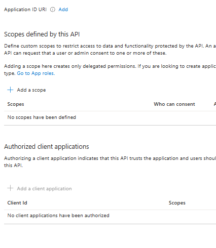
*`svc-foundry-dataplane-access-dev` — Expose an API: neither App ID URI nor scope is needed*

Here **neither** the Application ID URI **nor** a scope is needed, because **no one "authenticates" against this registered application**. The bot uses `client_id` + `client_secret` to **impersonate** the application and request a token, in its own name, toward Foundry:

```js
const foundryCredential = new ClientSecretCredential(
    process.env.FOUNDRY_ACCESS_TENANT_ID,
    process.env.FOUNDRY_ACCESS_CLIENT_ID,
    process.env.FOUNDRY_ACCESS_CLIENT_SECRET
);
foundryCredential.getToken('https://ai.azure.com/.default');
```

Foundry extracts that token from the header and uses it to perform OBO, preserving the same user indicated in the received token:

```python
# Token D: App-OBO (confidential client) exchanges
# Token C for a Graph token.
import msal  # On-Behalf-Of token exchange (C -> MS Graph)
GRAPH_SCOPES = ["https://graph.microsoft.com/Files.Read"]
user_assertion = context.client_headers.get(CLIENT_USER_TOKEN_HEADER, "")
app = msal.ConfidentialClientApplication(
    client_id,
    client_credential=client_secret,
    authority=f"https://login.microsoftonline.com/{tenant}",
)
result = app.acquire_token_on_behalf_of(
    user_assertion=user_assertion, scopes=GRAPH_SCOPES
)
```

### A.3.3 Downstream Access registered application (App-OBO)

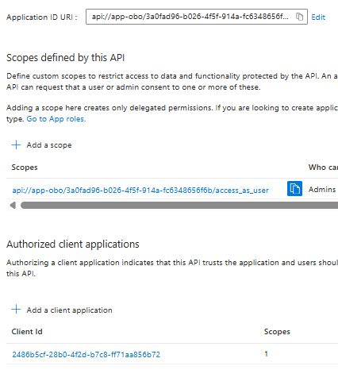
*`svc-agent-obo-downstream-dev` — Expose an API: the `access_as_user` scope and the authorized client (the Bot)*

This scope is used when the bot creates the token to pass to Foundry in the `x-client-user-token` parameter — associated with the user connected to Teams (which the bot finds in the token it received from Teams) and destined for this downstream OBO app.

The **authorized client application** shown here is the application authorized to request tokens for this downstream OBO app; as noted, the token is requested by the **bot**, using the identity indicated in the user token it received from Teams — i.e. the **Bot Registered Application**.

## A.4 API Permissions

### A.4.1 Bot registered application

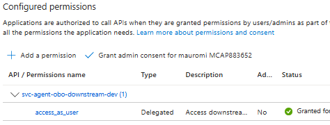
*Bot — API Permissions: delegated permission to the App-OBO app + admin consent*

Here we specify the **delegated permissions** granted to the app, so that it can exchange its "own" tokens (those with `aud = api://botid-2486…` sent by Teams) for tokens with the **same user** but the scope of further Entra-protected services.

Specifically, since the bot must generate a token for the OBO app `svc-agent-obo-downstream-dev` with scope `access_as_user`, we declare here the delegation toward that app and scope.

The **"Grant for &lt;tenant_name&gt;"** avoids the consent that would otherwise be requested from the user.

### A.4.2 Downstream Access (App-OBO)

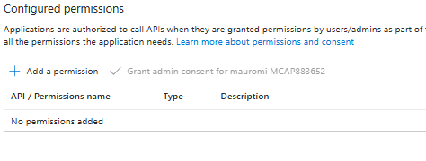
*`svc-agent-obo-downstream-dev` — API Permissions: Microsoft Graph `Files.Read` (delegated)*

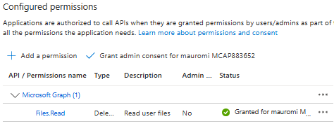
*`svc-agent-obo-downstream-dev` — API Permissions: admin consent granted*

Here we specify the **delegated permissions** granted to the app, so that it can exchange its "own" tokens (those with `aud = api://app-obo/3a0f…`) for tokens with the **same user** but the scope of further Entra-protected services.

Specifically, since the hosted agent must "exchange" the token received from the bot through the `x-client-user-token` header — which has `aud = api://app-obo/3a0f…` and `user = <Teams_user>` — for a token with `aud = MS Graph` and `scp = Files.Read`, it needs the `client_id` + `client_secret` of the same downstream OBO app.

The **"Grant for &lt;tenant_name&gt;"** avoids the consent that would otherwise be requested from the user.

---

**Back to:** [README / Introduction](../README.md) · [Final Result](00-final-result.md)
